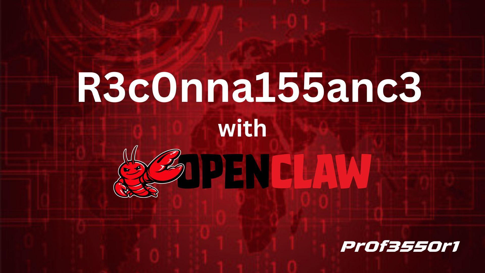

# recon_openclaw

Automated bug bounty reconnaissance pipeline that runs a full recon workflow and optionally launches **OpenClaw** for AI-assisted analysis of results.

---

## Features

- Subdomain enumeration (subfinder + assetfinder)
- Live host detection (httpx)
- Historical URL collection (gau + waybackurls)
- Crawling (katana)
- Port scanning (naabu + nmap)
- Technology detection (whatweb)
- Content discovery (ffuf + SecLists)
- Screenshot capture (gowitness)
- Vulnerability scanning (nuclei + nikto)
- Structured output with auto-generated markdown report and JSON summary
- Optional OpenClaw launch for analysis
- Color-coded terminal output with per-step elapsed timing
- Pre-flight tool verification with graceful exit on missing tools
- Per-step error logging to `report/errors.log`

---

## Installation

```bash
git clone https://github.com/yourname/recon_openclaw.git
cd recon_openclaw
sudo ./scripts/install_tools.sh
```

Make the main script executable:

```bash
chmod +x recon_openclaw.sh
```

---

## Usage

Basic scan:

```bash
./recon_openclaw.sh example.com
```

Scan and launch OpenClaw automatically at the end:

```bash
./recon_openclaw.sh --with-openclaw example.com
```

Log output to file:

```bash
./recon_openclaw.sh example.com | tee recon_run.log
```

---

## Flags Reference

| Flag | Default | Description |
|---|---|---|
| `--help` | — | Print usage information and exit |
| `--with-openclaw` | off | Launch OpenClaw for AI-assisted analysis after the scan |
| `--threads N` | `50` | Number of concurrent threads passed to `ffuf` and `naabu` |
| `--output-dir DIR` | `recon_<target>_<timestamp>` | Override the default timestamped output folder name |
| `--skip STEPS` | — | Comma-separated list of pipeline steps to skip (see step names below) |

### Step names for `--skip`

| Step name | Description |
|---|---|
| `subdomains` | Subdomain enumeration (subfinder + assetfinder) |
| `alive` | Live host detection (httpx) |
| `urls` | URL collection (gau + waybackurls) |
| `crawl` | Web crawling (katana) |
| `ports` | Port scanning (naabu + nmap) |
| `tech` | Technology detection (whatweb) |
| `ffuf` | Content discovery (ffuf) |
| `screenshots` | Screenshot capture (gowitness) |
| `vulns` | Vulnerability scanning (nuclei + nikto) |
| `report` | Report generation (markdown + JSON summary) |

Example — skip screenshots and nikto-heavy steps:

```bash
./recon_openclaw.sh --threads 100 --skip screenshots,vulns example.com
```

---

## Output Structure

Each scan creates a timestamped folder:

```
recon_example.com_20260101_120000/
├── subdomains/
│   ├── subfinder.txt
│   ├── assetfinder.txt
│   └── all.txt
├── alive/
│   └── alive.txt
├── urls/
│   ├── gau.txt
│   ├── wayback.txt
│   ├── katana.txt
│   └── all_urls.txt
├── ports/
│   ├── naabu.txt
│   └── nmap.txt
├── technologies/
│   └── whatweb.txt
├── screenshots/
├── vulnerabilities/
│   ├── nuclei.txt
│   ├── ffuf_*.json
│   └── nikto_*.txt
└── report/
    ├── report.md
    ├── summary.json
    └── errors.log
```

`summary.json` structure:

```json
{
  "target": "example.com",
  "timestamp": "20260101_120000",
  "subdomain_count": 42,
  "live_host_count": 18,
  "url_count": 3200,
  "nuclei_finding_count": 5
}
```

---

## Tools Used

| Tool         | Purpose                   | Install                                          |
|--------------|---------------------------|--------------------------------------------------|
| subfinder    | Subdomain enumeration     | `go install github.com/projectdiscovery/subfinder/v2/cmd/subfinder@latest` |
| assetfinder  | Subdomain enumeration     | `go install github.com/tomnomnom/assetfinder@latest` |
| httpx        | Live host detection       | `go install github.com/projectdiscovery/httpx/cmd/httpx@latest` |
| gau          | Historical URLs           | `go install github.com/lc/gau/v2/cmd/gau@latest` |
| waybackurls  | Historical URLs           | `go install github.com/tomnomnom/waybackurls@latest` |
| katana       | Web crawling              | `go install github.com/projectdiscovery/katana/cmd/katana@latest` |
| naabu        | Port scanning             | `go install github.com/projectdiscovery/naabu/v2/cmd/naabu@latest` |
| nmap         | Port/service scanning     | `apt install nmap` |
| whatweb      | Technology detection      | `apt install whatweb` |
| ffuf         | Content discovery         | `apt install ffuf` |
| gowitness    | Screenshots               | `go install github.com/sensepost/gowitness@latest` |
| nuclei       | Vulnerability scanning    | `go install github.com/projectdiscovery/nuclei/v3/cmd/nuclei@latest` |
| nikto        | Vulnerability scanning    | `apt install nikto` |
| openclaw     | AI-assisted analysis      | Install separately |

---

## Quick Cheat Sheet

```bash
chmod +x recon_openclaw.sh
./recon_openclaw.sh example.com
./recon_openclaw.sh --with-openclaw example.com
./recon_openclaw.sh --threads 100 --skip screenshots,vulns example.com
./recon_openclaw.sh --output-dir my_recon example.com
./recon_openclaw.sh example.com | tee recon_run.log

# Verify all tools are installed without installing anything
./scripts/install_tools.sh --check
```

---

## Troubleshooting

### Tool not found

If the pipeline exits with `The following required tools are not installed or not in PATH`, run the installer:

```bash
sudo ./scripts/install_tools.sh
```

After installation, ensure your shell has the Go binary path loaded:

```bash
source ~/.bashrc   # or source ~/.zshrc
```

To confirm a specific tool is available:

```bash
which subfinder
subfinder --version
```

### Permission denied

If you see `Permission denied` when running the script, mark it executable:

```bash
chmod +x recon_openclaw.sh
```

If `install_tools.sh` fails with permission errors, ensure you are running it as root:

```bash
sudo ./scripts/install_tools.sh
```

### Empty results

- **No subdomains**: The target may have no public subdomains indexed, or subfinder/assetfinder API rate limits may have been hit. Try adding API keys to `~/.config/subfinder/provider-config.yaml`.
- **No live hosts**: All discovered subdomains may be inactive, or httpx may not be resolving them. Try running `httpx` manually against the subdomains list.
- **No URLs**: gau and waybackurls depend on public archive indexes. Results may be sparse for newer or less-trafficked targets.
- **Empty ffuf output**: Check that `/usr/share/seclists/Discovery/Web-Content/directory-list-2.3-medium.txt` exists. If not, re-run `sudo ./scripts/install_tools.sh` to clone SecLists.
- **Check errors.log**: Any step failures are logged to `<output_dir>/report/errors.log` — review it for tool-specific error messages.

---

## Contributing

Contributions are welcome! Please follow these guidelines when submitting a pull request:

1. **Fork** the repository and create a feature branch from `main`:
   ```bash
   git checkout -b feature/my-improvement
   ```
2. **Keep changes focused** — one feature or fix per PR. Large, unrelated changes will be asked to be split up.
3. **Test your changes** manually against a real target (or a test environment) before submitting.
4. **Update the README** if your change adds or modifies a flag, step, or output file.
5. **Write a clear PR description** explaining what the change does and why, including any relevant commands used for testing.
6. **Do not commit secrets** — API keys, tokens, or credentials must never appear in the repository.
7. Open your pull request against the `main` branch with a descriptive title.

---

## Disclaimer

This tool is intended for authorized security testing and bug bounty programs only. Always ensure you have explicit permission before scanning any target. Unauthorized use is illegal.

---

## Credits

Inspired by the recon workflow article by [ghostyjoe](https://medium.com/bug-bounty-hunting-a-comprehensive-guide-in).
